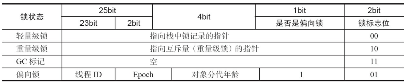
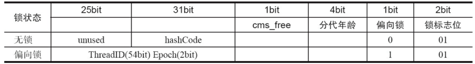

synchronized用的锁是存在Java对象头里的。如果对象是数组类型，则虚拟机用3个字宽（Word）存储对象头，如果对象是非数组类型，则用2字宽存储对象头。在32位虚拟机中，1字宽等于4字节，即32bit，如表2-2所示。

表2-2 Java对象头的长度

长度|内容|说明
----|----|---
32/64bit|Mark Word|存储对象的hashCode或锁的信息等
32/64bit|Class Metadata Address|存储到对象类型数据的指针
32/64bit|Array length|数组的长度(如果当前对象是数组)
Java对象头里的Mark Word里默认存储对象的HashCode、分代年龄和锁标记位。32位JVM的Mark Word的默认存储结构如表2-3所示。

表2-3 Java对象头的存储结构

锁状态|25bit|4bit|1bit是否是偏向锁|2bit锁标志位
----|---|---|---|---
无锁状态|对象的hashCode|对象分代年龄|0|01
在运行期间，Mark Word里存储的数据会随着锁标志位的变化而变化。Mark Word可能变
化为存储以下4种数据，如表2-4所示。

在64位虚拟机下，Mark Word是64bit大小的，其存储结构如表2-5所示。

